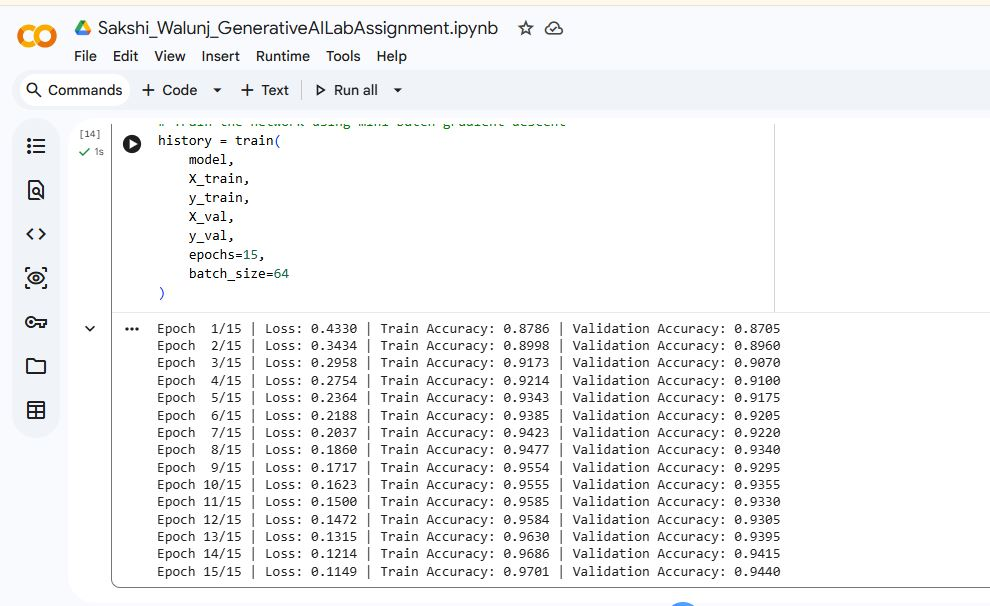
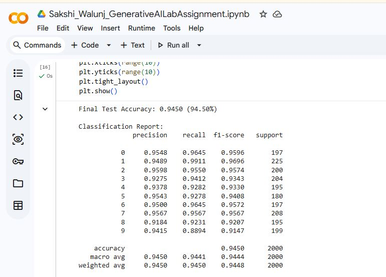
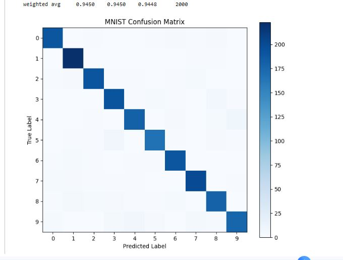
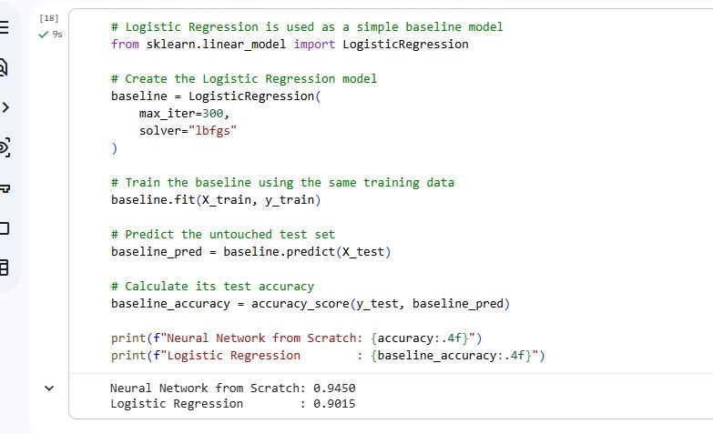

# Practice Lab Assignment 1 - Neural Network Implementation from Scratch

## Objective

The aim of this practical is to understand how a basic feedforward neural network works by implementing it from scratch using Python and NumPy.

Forward propagation, backpropagation, loss calculation and gradient descent are implemented manually without using TensorFlow, Keras or PyTorch.

## Dataset

The MNIST handwritten digit dataset is used for classification. Each image is 28 × 28 pixels, giving 784 input features after flattening.

For this practical, 12,000 images were used:

| Data | Images | Purpose |
|---|---:|---|
| Training | 8,000 | Train the model |
| Validation | 2,000 | Check performance during training |
| Testing | 2,000 | Final evaluation |

The test data was kept separate from training.

Dataset source: [MNIST on OpenML](https://www.openml.org/d/554)

## Neural Network

The network has one hidden layer:

```text
784 Input Neurons
        ↓
64 Hidden Neurons
        ↓
ReLU
        ↓
10 Output Neurons
        ↓
Softmax
```

ReLU is used in the hidden layer and Softmax is used at the output layer.

Cross-Entropy Loss is used to calculate the prediction error. The weights are initialized using He initialization.

## Training

Mini-batch gradient descent is used with a batch size of 64.

For each batch, the network performs a forward pass, calculates the loss, performs backpropagation and updates the weights and biases.

The model was trained for 15 epochs. The validation set was used to check the model during training, while the test set was kept aside for the final evaluation.

## Results

The final results were:

| Metric | Result |
|---|---:|
| Training Accuracy | 97.01% |
| Validation Accuracy | 94.40% |
| Test Accuracy | **94.50%** |
| Logistic Regression | 90.15% |

The training loss decreased from **0.4330** to **0.1149** during training.

## Performance Screenshots

### Training Performance



### Classification Report



### Confusion Matrix



### Model Comparison



## Comparison with Logistic Regression

Logistic Regression was used as a simple baseline model.

Both models were trained using the same 8,000 training images and evaluated on the same 2,000 test images.

The neural network achieved **94.50%**, while Logistic Regression achieved **90.15%**. The neural network performed better by **4.35 percentage points**.

## Analysis

The decrease in training loss and increase in accuracy show that the network learned from the training data.

The final test accuracy of 94.50% shows that the model classified most of the unseen MNIST images correctly. Some errors occurred between digits with similar handwritten shapes.

The neural network also performed better than the Logistic Regression baseline, showing that the hidden layer helped it learn more complex patterns.

## Technologies Used

- Python
- NumPy
- Matplotlib
- Scikit-learn
- Jupyter Notebook

Scikit-learn was used for dataset loading, data splitting, evaluation metrics and the Logistic Regression comparison. The neural network itself was implemented using NumPy.

## How to Run

Install the required libraries:

```bash
pip install numpy matplotlib scikit-learn jupyter
```

Open Jupyter Notebook:

```bash
jupyter notebook
```

Open the `.ipynb` file from the `Assignment-1` folder and run the cells in order.

The MNIST dataset will be downloaded automatically when the dataset-loading cell is executed.

## Project Structure

```text
Deep-Learning/
│
├── Assignment-1/
│   ├── Practice_Lab_1_MNIST_From_Scratch.ipynb
│   ├── README.md
│   └── screenshots/
│       ├── training.JPG
│       ├── classification.JPG
│       ├── confusion_matrix.JPG
│       └── model_comparison.JPG
│
└── README.md
```

## Conclusion

A feedforward neural network was implemented from scratch using NumPy for MNIST digit classification.

The model achieved **94.50% test accuracy** and performed better than the Logistic Regression baseline. This practical helped in understanding how forward propagation, backpropagation and gradient descent work inside a neural network.

## Student Details

**Name:** Sakshi Walunj  
**PRN No:** 202201040092  
**Branch:** CSE (AI & ML)  
**Batch:** A3

